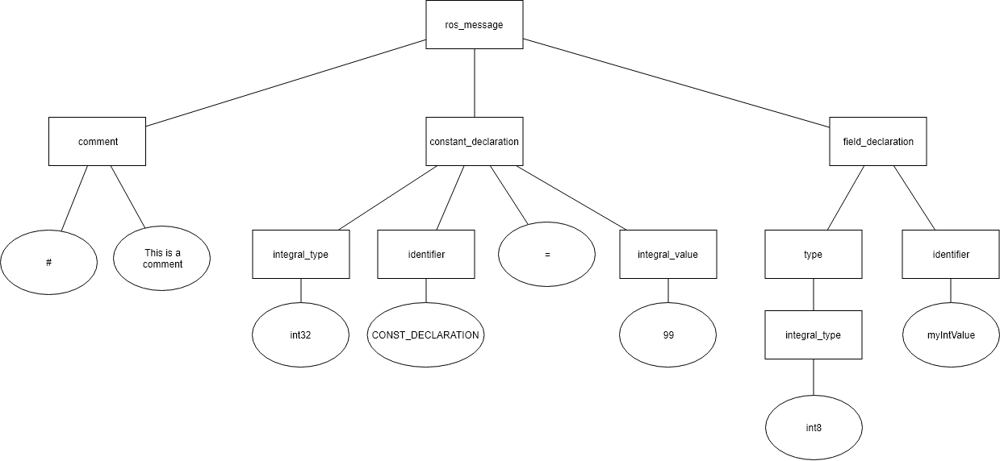

# ROS Message Parser for .NET
> Hanlde ROS message files with ease

ROS Message Parser allows you to parse ROS message/service/action files.

You can either use one built in Parser for
* Messages (*.msg)
* Services (*.srv)
* Actions (*.action)

or build your own visitors or listeners on top of the generated parse tree.


## Installation

ROS Message Parser for .Net is available as [NuGet Package](https://www.nuget.org/packages/RobSharper.Ros.MessageParser/).


```
dotnet add package RobSharper.Ros.MessageParser
``` 

### Supported .NET versions
 
* **.NET Standard 2.0**
    * .NET Core 2.0 or later
    * .NET Framework 4.6.1 or later
    * Mono 5.4 or later
    * Xamarin.iOS 10.14 or later
    * Xamarin.Mac 3.8 or later
    * Xamarin.Android 8.0 or later
    * Universal Windows Platform 10.0.16299 or later

### Dependencies

* [ANTLR 4 .NET Standard Runtime](https://www.nuget.org/packages/Antlr4.Runtime.Standard/)

## Usage


### Built in Parsers

> Use the built in parsers if you want to get a structured representation of a ROS message.

**Parsing a message file**
```csharp
var descriptor = new MessageParser(File.ReadAllText(filePath)).Parse();
```
or
```csharp
MessageDescriptor descriptor;
            
using (var file = File.OpenRead(filePath))
{
    var parser = new MessageParser(file)
    descriptor = parser.Parse();
}
```

**Parsing a service file**
```csharp
var descriptor = new ServiceParser(File.ReadAllText(filePath)).Parse();
```
or
```csharp
ServiceDescriptor descriptor;
            
using (var file = File.OpenRead(filePath))
{
    var parser = new ServiceParser(file);
    descriptor = parser.Parse();
}
```

**Parsing an action file**
```csharp
var descriptor = new ActionParser(File.ReadAllText(filePath)).Parse();
```
or
```csharp
ActionDescriptor descriptor;
            
using (var file = File.OpenRead(filePath))
{
    var parser = new ActionParser(file);
    descriptor = parser.Parse();
}
```


What you get from the parsers is a either a `MessageDescriptor`, `ServiceDescriptor` or a `ActionDescriptor`
representing the structure of the ROS message file. You can then operate on these message structures.

Have a look on the UML diagram below for a detailed description.


#### Intercepting descriptor creation

You can intercept the descriptor creation by creating a class which implements `RobSharper.Ros.MessageParser.IRosMessageVisitorListener`.
This allows you to implement the following methods used in the object tree creation:

* `void OnVisitRosMessage(MessageDescriptor messageDescriptor)`
* `void OnVisitRosService(ServiceDescriptor serviceDescriptor)`
* `void OnVisitRosAction(ActionDescriptor actionDescriptor)`
* `void OnVisitFieldDeclaration(FieldDescriptor fieldDescriptor)`
* `void OnVisitConstantDeclaration(ConstantDescriptor constDescriptor)`
* `void OnVisitComment(string comment)`
* `void OnVisitIdentifier(string identifier)`
* `void OnVisitType(RosTypeInfo typeInfo)`
* `void OnVisitRosType(RosTypeInfo typeInfo)`
* `void OnVisitBuiltinType(RosTypeInfo typeInfoDescriptor)`
* `void OnVisitArrayType(RosTypeInfo arrayTypeInfo)`
* `void OnVisitRosbagInput(RosbagMessageDefinitionDescriptor rosbag)`
* `void OnVisitRosbagNestedType(NestedTypeDescriptor descriptor);`

You can then pass this listener to the `Parse(IRosMessageVisitorListener listener)` method of the Parser.

One note regarding the Visit*Type Methods. They are ordered hierarchically the following way:

* OnVisitArrayType
    * OnVisitType
        * OnVisitBuiltInType
        * OnVisitRosType


### Create your own parse tree Visitor or Listener

> Used for low level parse tree processing.

Build your own [ANTLR](https://www.antlr.org/) visitor or listener to process the abstract syntax tree. 
Extend `RobSharper.Ros.MessageParser.Antlr.RosMessageParserBaseListener` or `RobSharper.Ros.MessageParser.Antlr.RosMessageParserBaseVisitor` respectively.

Having ANTLR IDE Support displaying the parse tree will make this expedition much more comfortable. See https://www.antlr.org/tools.html for a list of supported IDE plugins

**Example**
Assume the following ros message file:

```
#This is a comment
int32 CONST_DECLARATION = 99
int8 myIntValue
```

The Parser creates the following abstract syntax tree based on the input message:

 

The base visitor and listener classes implement methods for all tree node types which you can override. 
The [grammar](RobSharper.Ros.MessageParser/RosMessageParser.g4) defines these tree node types.


## Contributing

ROS Message Parser for .NET is based on [ANTLRv4](https://www.antlr.org/). 
If you are not familiar with ANTLR there is a good tutorial from Gabriele Tomasetti (https://tomassetti.me/antlr-mega-tutorial/)

### Testing the project

XUnit tests can be found in RobSharper.Ros.MessageParser.Tests project. This project references [coverlet](https://github.com/tonerdo/coverlet) for collecting code coverage information and [ReportGenerator](https://github.com/danielpalme/ReportGenerator) to transform the coverage report to readable HTML. 
The reports are part of the CI test stage artifacts.

To collect coverage information on your machine use the command `dotnet test /p:CollectCoverage=true /p:Exclude="[xunit*]*" /p:CoverletOutputFormat=opencover`.

## License

This project is licensed under the BSD 3-clause license. [Learn more](https://choosealicense.com/licenses/bsd-3-clause/)