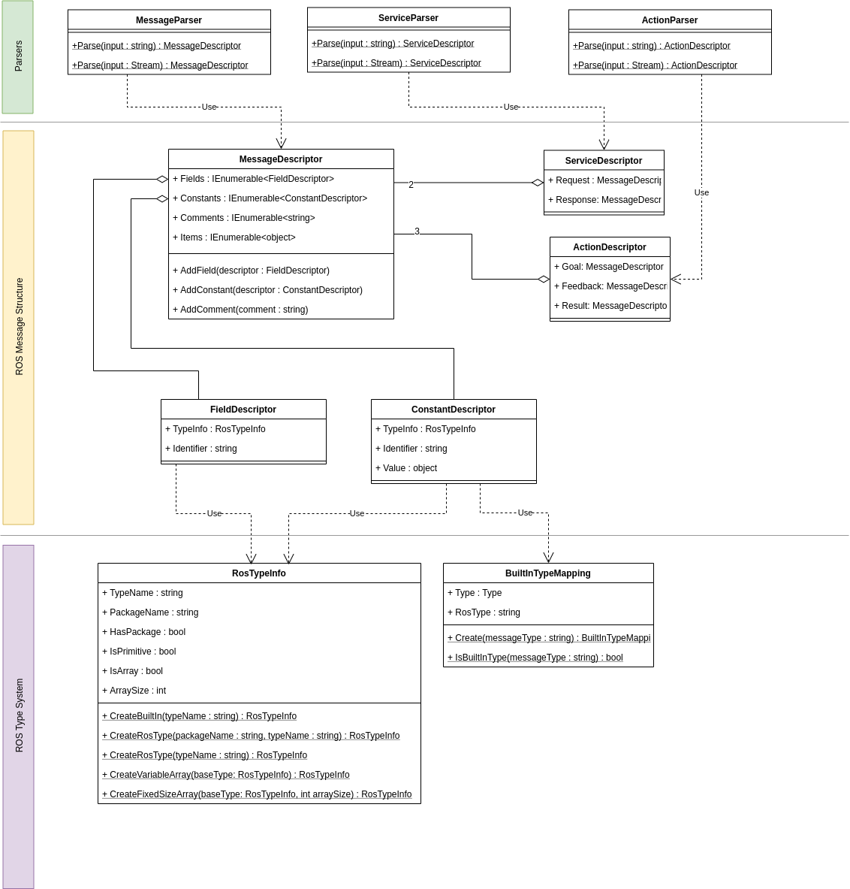

# ROS Message Parser for .Net
> Hanlde ROS message files with ease

ROS Message Parser allows you to parse ROS message/service/action files.

You can either use one built in Parser for
* Messages (*.msg)
* Services (*.srv)
* Actions (*.action)

or build your own visitors or listeners on top of the generated parse tree.


## Installation

ROS Message Parser for .Net is available as NuGet Package. 

**TODO** Publish as nuget.

## Usage


### Built in Parsers

> Use the built in parsers if you want to get a structured representation of a ROS message.

**Parsing a message file**
```csharp
var descriptor = MessageParser.Parse(File.ReadAllText(filePath));
```
or
```csharp
MessageDescriptor descriptor;
            
using (var file = File.OpenRead(filePath))
{
    descriptor = MessageParser.Parse(file);
}
```

**Parsing a service file**
```csharp
var descriptor = ServiceParser.Parse(File.ReadAllText(filePath));
```
or
```csharp
ServiceDescriptor descriptor;
            
using (var file = File.OpenRead(filePath))
{
    descriptor = ServiceParser.Parse(file);
}
```

**Parsing an action file**
```csharp
var descriptor = ActionParser.Parse(File.ReadAllText(filePath));
```
or
```csharp
ActionDescriptor descriptor;
            
using (var file = File.OpenRead(filePath))
{
    descriptor = ActionParser.Parse(file);
}
```


What you get from the parsers is a either a `MessageDescriptor`, `ServiceDescriptor` or a `ActionDescriptor`
representing the structure of the ROS message file.

Have a look on the UML diagram below for a detailed description.




### Build your own Visitor

> Use this if you want to directly operate on the generated parse tree.

You can either intercept the generation of the descriptor instances for the section above or create your stand alone visitor.

#### Intercepting descriptor creation

Create a class extending `Joanneum.Robotics.Ros.MessageParser.RosMessageVisitor`.

This allow you to override one of the following methods used in the object tree creation:

* `protected internal virtual MessageDescriptor OnVisitRosMessage(MessageDescriptor messageDescriptor)`
* `protected internal virtual ServiceDescriptor OnVisitRosService(ServiceDescriptor serviceDescriptor)`
* `protected internal virtual ActionDescriptor OnVisitRosAction(ActionDescriptor actionDescriptor)`
* `protected internal virtual FieldDescriptor OnVisitFieldDeclaration(FieldDescriptor fieldDescriptor)`
* `protected internal virtual ConstantDescriptor OnVisitConstantDeclaration(ConstantDescriptor constDescriptor)`
* `protected internal virtual string OnVisitComment(string comment)`
* `protected internal virtual string OnVisitIdentifier(string identifier)`
* `protected internal virtual RosTypeInfo OnVisitRosType(RosTypeInfo typeInfo)`
* `protected internal virtual PrimitiveTypeInfo OnVisitPrimitiveType(PrimitiveTypeInfo typeInfoDescriptor)`
* `protected internal virtual ArrayTypeInfo OnVisitArrayType(ArrayTypeInfo arrayTypeInfo)`


**TODO** 


## Development

ROS Message Parser for .Net is based on [ANTLRv4](https://www.antlr.org/).